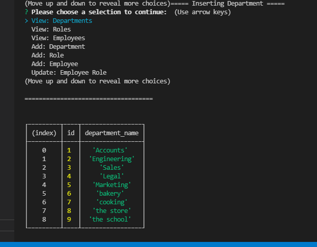
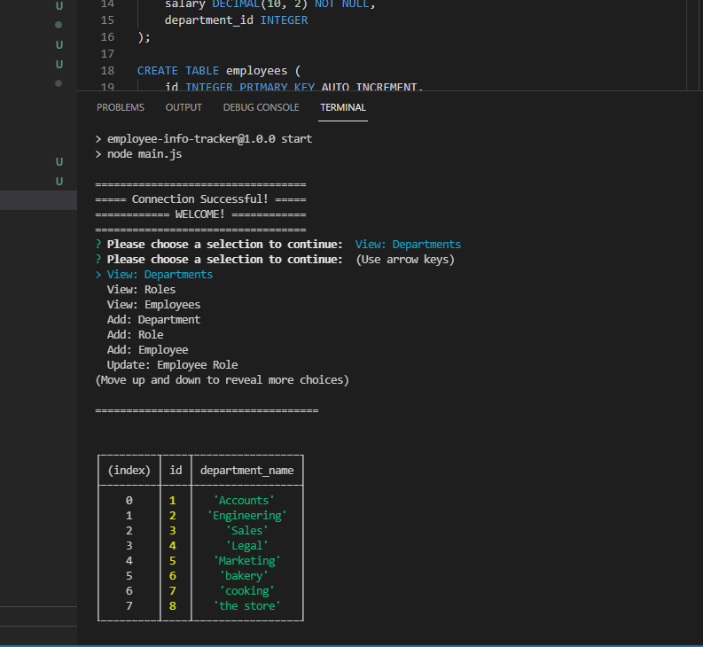

# Employee-Info-Tracker
## About the employee generator:

The purpose of this educational assignment was to create a command line application that creates a interface to view and interact with information stored in a database.

1. Present user with command line 
2. User runs 'npm start' to begin
3. User is presented with selections to choose
4. User is to select a choice and presses 'enter'
5. User is presented with a table of information from a db
6. When the user if finished, user is presented with additiona choices
7. Selecting 'exit' will terminate
8. User is brought back to CLI

## Built With:

* Node
* Javascript
* MySQL / MySQL workbench

## Use:

User can create a team/employee info card list.

Install:
* npm init
* npm install inquirer
* npm install mysql 

Run:
* npm start
    OR
* node main.js

*Used to learn, practice, test, understand, and implement various JavaScript tools including test driven development: 

* CRUD
* MySQL workbench and CLI shell
* Node.js built in function 'require' to load modules
* create CLI with promise-based npm 'inquirer' package
* create and display CLI tables 'console.table'
* create and use 'module.export'
* primary and foreign keys
* dotenv file 

## Contact:

* https://github.com/kitclong/Employee-Info-Tracker
* https://youtu.be/

## Acknowledgments:

* npm
* MDN Web Docs
* w3schools
* Stackoverflow
* Freecodecamp
* Trilogy Education services
* local tutoring services
* Additional private tutoring 
